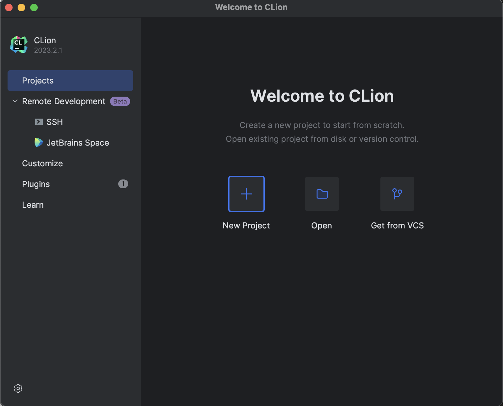

# Setup SDL with CMake and CPM

In my opinion, the minimum toolset needed to give you the ability to start creating games cross-platform from scratch is the combination of the following tools:

<!-- more -->

1. [CLion](https://www.jetbrains.com/clion/) - Cross-platform C++ IDE with embedded CMake support
    
    - [Apply for a student license](https://www.jetbrains.com/community/education);
    - [Download](https://www.jetbrains.com/clion/download) and install it;
    - For Macs, you will need extra tools: `XCode` and the command line tools. You can install them by running `xcode-select --install` on the terminal;

2. (Required for Windows and if you don't use CLion) [Git](https://git-scm.com/) - Version control system

    - [Download](https://git-scm.com/downloads) only if you are on Windows and don't forget to tick the option to add it to your environment path (CMake will be calling it). On Mac and Linux, you can install via your package manager (ex. brew on Mac e apt on Ubuntu).

After installing the tool(s) above, you can follow the steps below to create a new project:

## CLion project

1. Open CLion and select `New Project`:



2. Create a new project and select `C++ Executable` and `C++XX` as the language standard, where `XX` is the latest one available for you. Use the default compiler and toolchain:


3. Start coding:


You might note the existence of a `CMakeLists.txt` file on the left side of the IDE on the `Project` tab. This file is used by CMake to generate the build files for your project. Now, we are going to set up everything you need to use `SDL3`. If you open the `CMakeLists.txt` file, you will see something similar to the following:

```cmake
# cmake_minimum_required(VERSION <specify CMake version here>)
cmake_minimum_required(VERSION 3.26)
# project(<name> [<language-name>...])
project(MyGame)
# set(CMAKE_CXX_STANDARD <specify C++ standard here>)
set(CMAKE_CXX_STANDARD 17)
# add_executable(<name> file.cpp file2.cpp ...)
add_executable(MyGame main.cpp)
```

## CPM - C++ Package Manager

CPM is a setup-free C++ package manager. It is a single CMake script that you can add to your project and use to download and install packages from GitHub. It is a great tool to manage dependencies and many C++ projects use it.

You can make this as simple as adding the following lines to your `CMakeLists.txt` file (after the `project` command):

```cmake
set(CPM_DOWNLOAD_VERSION 0.38.2)

if(CPM_SOURCE_CACHE)
  set(CPM_DOWNLOAD_LOCATION "${CPM_SOURCE_CACHE}/cpm/CPM_${CPM_DOWNLOAD_VERSION}.cmake")
elseif(DEFINED ENV{CPM_SOURCE_CACHE})
  set(CPM_DOWNLOAD_LOCATION "$ENV{CPM_SOURCE_CACHE}/cpm/CPM_${CPM_DOWNLOAD_VERSION}.cmake")
else()
  set(CPM_DOWNLOAD_LOCATION "${CMAKE_BINARY_DIR}/cmake/CPM_${CPM_DOWNLOAD_VERSION}.cmake")
endif()

# Expand relative path. This is important if the provided path contains a tilde (~)
get_filename_component(CPM_DOWNLOAD_LOCATION ${CPM_DOWNLOAD_LOCATION} ABSOLUTE)

function(download_cpm)
  message(STATUS "Downloading CPM.cmake to ${CPM_DOWNLOAD_LOCATION}")
  file(DOWNLOAD
       https://github.com/cpm-cmake/CPM.cmake/releases/download/v${CPM_DOWNLOAD_VERSION}/CPM.cmake
       ${CPM_DOWNLOAD_LOCATION}
  )
endfunction()

if(NOT (EXISTS ${CPM_DOWNLOAD_LOCATION}))
  download_cpm()
else()
  # resume download if it previously failed
  file(READ ${CPM_DOWNLOAD_LOCATION} check)
  if("${check}" STREQUAL "")
    download_cpm()
  endif()
  unset(check)
endif()

include(${CPM_DOWNLOAD_LOCATION})
```

This will download the `CPM.cmake` file to your project, and you can use it to download and install packages from GitHub. 

To check if `CPM` is being automatically downloaded, you can go to `CLion` and click on `CMake` :simple-cmake: icon on the left side of the `Project`. It is the first one on the bottom. And then click the `Reload CMake Project` :material-reload: button:


Now that you have `CPM`, you can start adding packages to your project. Here are some ways of doing that:

```cmake
# A git package from a given uri with a version
CPMAddPackage("uri@version")
# A git package from a given uri with a git tag or commit hash
CPMAddPackage("uri#tag")
# A git package with both version and tag provided
CPMAddPackage("uri@version#tag")
# examples:
# CPMAddPackage("gh:fmtlib/fmt#7.1.3")
# CPMAddPackage("gh:nlohmann/json@3.10.5")
# CPMAddPackage("gh:catchorg/Catch2@3.2.1")
# An archive package from a given url. The version is inferred
# CPMAddPackage("https://example.com/my-package-1.2.3.zip")
# An archive package from a given url with an MD5 hash provided
# CPMAddPackage("https://example.com/my-package-1.2.3.zip#MD5=68e20f674a48be38d60e129f600faf7d")
# An archive package from a given url. The version is explicitly given
# CPMAddPackage("https://example.com/my-package.zip@1.2.3")

# A complex package with options:
CPMAddPackage(
        NAME          # The unique name of the dependency (should be the exported target's name)
        VERSION       # The minimum version of the dependency (optional, defaults to 0)
        OPTIONS       # Configuration options passed to the dependency (optional)
        DOWNLOAD_ONLY # If set, the project is downloaded, but not configured (optional)
        GITHUB_REPOSITORY # The GitHub repository (owner/repo) to download from (optional)
        GIT_TAG       # The git tag or commit hash to download (optional)
        [...]         # Origin parameters forwarded to FetchContent_Declare
)
```

## SDL

In order to generate `SDL` libraries and link them corretly in our executable, we have to state the lib should be in the same folder as the executable, so you have to add this to your `CMakeLists.txt` file:

```cmake 
# Set all outputs to be at the same location
set(CMAKE_ARCHIVE_OUTPUT_DIRECTORY ${CMAKE_BINARY_DIR})
set(CMAKE_LIBRARY_OUTPUT_DIRECTORY ${CMAKE_BINARY_DIR})
set(CMAKE_RUNTIME_OUTPUT_DIRECTORY ${CMAKE_BINARY_DIR})
link_directories(${CMAKE_BINARY_DIR})
```

Now that we have `CPM` set up, we can use it to download and install `SDL`. If you want to try the stable version `v2`, add the following lines to your `CMakeLists.txt` file and refresh CMake:

```cmake
CPMAddPackage(
  NAME SDL2
  GITHUB_REPOSITORY libsdl-org/SDL
  GIT_TAG release-2.28.3 
  VERSION 2.28.3
)
```

If you don't have `git` installed on your machine, you might want to use the `ZIP` version(it is even faster to download but slower to switch versions). In this case, you can use the following lines and refresh CMake:

```cmake
CPMAddPackage(
  NAME SDL2
  URL "https://github.com/libsdl-org/SDL/archive/refs/tags/release-2.28.3.zip"
  VERSION 2.28.3
)
```

If you want to try the bleeding edge version `v3`, add the following lines to your `CMakeLists.txt` file at your own risk:

```cmake
CPMAddPackage(
  NAME SDL3
  GITHUB_REPOSITORY libsdl-org/SDL
  GIT_TAG main
)
```

Now that we have `SDL` set up, we should link it to our project. In order to do that, we can add the following lines after the line `add_executable` to our `CMakeLists.txt` file and refresh CMake:

```cmake
target_link_libraries(MyGame SDL2::SDL2)
# change SDL2 to SDL3 if you are using the bleeding edge version
#target_link_libraries(MyGame SDL2::SDL2)
```

And this will make `SDL` available to our project. Now we can start coding. Let's create a simple window:

```cpp
#define SDL_MAIN_HANDLED true
#include <SDL.h>

int main(int argc, char** argv) {
    SDL_Init(SDL_INIT_VIDEO);

    SDL_Window* window = SDL_CreateWindow(
            "SDL2Test",
            SDL_WINDOWPOS_UNDEFINED,
            SDL_WINDOWPOS_UNDEFINED,
            640,
            480,
            0
    );

    SDL_Renderer* renderer = SDL_CreateRenderer(window, -1, SDL_RENDERER_ACCELERATED);

    SDL_Event e;
    bool quit = false;
    while (!quit){
        while (SDL_PollEvent(&e)){
            if (e.type == SDL_QUIT){
                quit = true;
            }
        }

        SDL_SetRenderDrawColor(renderer, 255, 0, 0, 255);
        SDL_RenderClear(renderer);
        SDL_RenderPresent(renderer);
        SDL_Delay(0);
    }

    SDL_DestroyWindow(window);
    SDL_Quit();

    return 0;
}
```

If you feel that you want to test the bleeding-edge version, you can use this code instead:

```cpp
#define SDL_MAIN_HANDLED true
#include <SDL.h>

int main(int argc, char* argv[]) {
    SDL_Init(SDL_INIT_VIDEO);

    SDL_Window *window = SDL_CreateWindow(
            "MyGame",
            640,
            480,
            0
    );

    SDL_Renderer* renderer = SDL_CreateRenderer(window, nullptr, SDL_RENDERER_ACCELERATED);
    SDL_Event e;
    bool quit = false;

    while (!quit) {
        while (SDL_PollEvent(&e)) {
            if (e.type == SDL_EVENT_QUIT) {
                quit = true;
            }
        }
        SDL_SetRenderDrawColor(renderer, 255, 0, 0, 255);
        SDL_RenderClear(renderer);
        SDL_RenderPresent(renderer);
        SDL_Delay(0);
    }

    SDL_DestroyWindow(window);
    SDL_Quit();
    
    return 0;
}
```

Now you have a way to code games with `SDL` in a way that is cross-platform, and easy to setup.

If you hit `Run` or `Debug` on `CLion`, you will see a window like this:


and then:


I hope it works for you. If you have any problems, please let me know on Discord or via GitHub issues.
