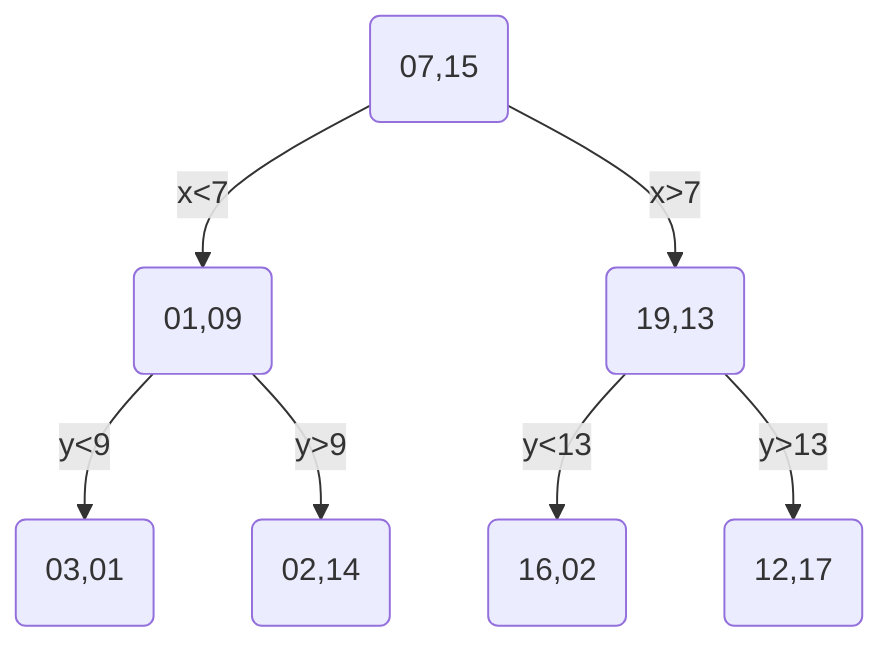

# KD-Trees

KD-Trees are a special type of binary trees that are used to partition a k-dimensional space. They are used to solve the problem of finding the nearest neighbor of a point in a k-dimensional space. The name KD-Tree comes from the method of partitioning the space, the K stands for the number of dimensions in the space.

## Methodology

- On the binary tree KD-Tree, each node represents a k-dimensional point;
- The tree is constructed by recursively partitioning the space into two half-spaces. 
- The partitioning is done by selecting a dimension and a value, and then splitting the space into two half-spaces. 
- The dimension and value are selected in such a way that the space is divided into two equal parts. 
- The left child of a node contains all the points for that dimension that are less than the value, and the right child contains all the points that are greater than or equal to the value.

## Example

Let's consider the following 2D points:

```
(3, 1), (7, 15), (2, 14), (16, 2), (19, 13), (12, 17), (1, 9)
```

```vegalite
{
    "$schema": "https://vega.github.io/schema/vega-lite/v4.json",
    "description": "A scatter plot of the points",
    "data": {
        "values": [
        {"x": 3, "y": 1},
        {"x": 7, "y": 15},
        {"x": 2, "y": 14},
        {"x": 16, "y": 2},
        {"x": 19, "y": 13},
        {"x": 12, "y": 17},
        {"x": 1, "y": 9}
        ]
    },
    "mark": "point",
    "encoding": {
        "x": {"field": "x", "type": "quantitative"},
        "y": {"field": "y", "type": "quantitative"}
    }
}
```

The first step is to define the root. For that we need do define two things: the dimension and the value:

- For the dimension we need to select the one that has the largest range. 
- For the value we need to select the median of that dimension.

So if we sort the points by the axis, we will have:

```
SortedByX = (1, 9), (3, 1), (2, 14), (7, 15), (12, 17), (16, 2), (19, 13)
SortedByY = (3, 1), (16, 2), (1, 9), (19, 13), (7, 15), (3, 15), (12, 17)
```

The largest range is on the X axis, so we will select the median of the X axis as the root. The median of the X axis is `(7, 15)`, and the starting dimension will be X.

For the next level, the left side candidates will be the ones with X less than `(7, 15)`, and the right side, the ones that are greater or equal to `(7, 15)`. But now this level will be governed sorted by Y:

```
LeftSortedByY  = (3, 1), (1, 9), (2, 14)
RightSortedByY = (16, 2), (19, 13), (12, 17)
```

Graph showing the first split on X at (7, 15):

The median for the left side is `(1, 9)`, and for the right side is `(19, 13)`.

The current state of the tree is:

```vegalite
{
  "$schema": "https://vega.github.io/schema/vega-lite/v4.json",
  "description": "A scatter plot of the points",
  "encoding": {
    "x": {"field": "x", "type": "quantitative"},
    "y": {"field": "y", "type": "quantitative"}
  },
  "layer": [
    {
      "data": {
        "values": [
          {"x": 3, "y": 1},
          {"x": 7, "y": 15},
          {"x": 2, "y": 14},
          {"x": 16, "y": 2},
          {"x": 19, "y": 13},
          {"x": 12, "y": 17},
          {"x": 1, "y": 9}
        ]
      },
      "mark": "point"
    },
    {
      "data": {
        "values": [
          {"x": 7, "y": 0},
          {"x": 7, "y": 20}
        ]
      },
      "mark": "line",
      "encoding": {
        "color": {
          "value": "#DB745B"
        }
      }
    }
  ]
}
```

Now we apply the same rules for the children of the left and right nodes.



The tree will be:

```vegalite
{
  "$schema": "https://vega.github.io/schema/vega-lite/v4.json",
  "description": "A scatter plot of the points",
  "encoding": {
    "x": {"field": "x", "type": "quantitative"},
    "y": {"field": "y", "type": "quantitative"}
  },
  "layer": [
    {
      "data": {
        "values": [
          {"x": 3, "y": 1},
          {"x": 7, "y": 15},
          {"x": 2, "y": 14},
          {"x": 16, "y": 2},
          {"x": 19, "y": 13},
          {"x": 12, "y": 17},
          {"x": 1, "y": 9}
        ]
      },
      "mark": "point"
    },
    {
      "data": {
        "values": [
          {"x": 7, "y": 0},
          {"x": 7, "y": 20}
        ]
      },
      "mark": "line",
      "encoding": {
        "color": {
          "value": "#DB745B"
        }
      }
    },
    {
      "data": {
        "values": [
          {"x": 0, "y": 9},
          {"x": 7, "y": 9}
        ]
      },
      "mark": "line",
      "encoding": {
        "color": {
          "value": "#4F72DB"
        }
      }
    },
    {
      "data": {
        "values": [
          {"x": 7, "y": 13},
          {"x": 20, "y": 13}
        ]
      },
      "mark": "line",
      "encoding": {
        "color": {
          "value": "#4F72DB"
        }
      }
    }
  ]
}
```

And lastly, we will have:

```vegalite
{
  "$schema": "https://vega.github.io/schema/vega-lite/v4.json",
  "description": "A scatter plot of the points",
  "encoding": {
    "x": {"field": "x", "type": "quantitative"},
    "y": {"field": "y", "type": "quantitative"}
  },
  "layer": [
    {
      "data": {
        "values": [
          {"x": 3, "y": 1},
          {"x": 7, "y": 15},
          {"x": 2, "y": 14},
          {"x": 16, "y": 2},
          {"x": 19, "y": 13},
          {"x": 12, "y": 17},
          {"x": 1, "y": 9}
        ]
      },
      "mark": "point"
    },
    {
      "data": {
        "values": [
          {"x": 7, "y": 0},
          {"x": 7, "y": 20}
        ]
      },
      "mark": "line",
      "encoding": {
        "color": {
          "value": "#DB745B"
        }
      }
    },
    {
      "data": {
        "values": [
          {"x": 0, "y": 9},
          {"x": 7, "y": 9}
        ]
      },
      "mark": "line",
      "encoding": {
        "color": {
          "value": "#4F72DB"
        }
      }
    },
    {
      "data": {
        "values": [
          {"x": 7, "y": 13},
          {"x": 20, "y": 13}
        ]
      },
      "mark": "line",
      "encoding": {
        "color": {
          "value": "#4F72DB"
        }
      }
    },
    {
      "data": {
        "values": [
          {"x": 3, "y": 0},
          {"x": 3, "y": 9}
        ]
      },
      "mark": "line",
      "encoding": {
        "color": {
          "value": "#93DB35"
        }
      }
    },
    {
      "data": {
        "values": [
          {"x": 2, "y": 9},
          {"x": 2, "y": 20}
        ]
      },
      "mark": "line",
      "encoding": {
        "color": {
          "value": "#93DB35"
        }
      }
    },
    {
      "data": {
        "values": [
          {"x": 12, "y": 13},
          {"x": 12, "y": 20}
        ]
      },
      "mark": "line",
      "encoding": {
        "color": {
          "value": "#93DB35"
        }
      }
    },
    {
      "data": {
        "values": [
          {"x": 16, "y": 13},
          {"x": 16, "y": 0}
        ]
      },
      "mark": "line",
      "encoding": {
        "color": {
          "value": "#93DB35"
        }
      }
    }
  ]
}
```
