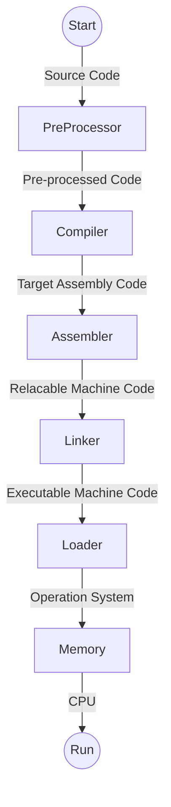

# Reasons why you should learn how to program with C++

Before we start, this repository aims to be practical, and I highly incentive you to look for other references. I want to add this another [awesome repository](https://github.com/federico-busato/Modern-CPP-Programming/) it holds an awesome compilation of modern C++ concepts.

Another relevant reference for what we are going to cover is the [updated core guidelines](https://isocpp.github.io/CppCoreGuidelines/CppCoreGuidelines) that explain why some syntax or style is bad and what you should be doing instead.

## Why?

The first thing when you think of becoming a programmer is **HOW DO I START?** Well, **C++** is one of the best 
programming languages to give you insights into how a computer works. Through the process of learning how to code 
C++, you will learn not only how to use this language as a tool to solve your problems, but the farther you go, the 
more you will start uncovering and **exploring exciting computer concepts**.

C++ gives you the **simplicity of C and adds a lot of steroids**. It delivers lots of quality-of-life stuff, increasing 
the developer experience. Let’s compare C with C++, shall we?

1. The iconic book _"The C Programming Language" by Brian W. Kernighan and Dennis M. Ritchie_ has **only 263 pages**. 
   Pretty simple, huh?
2. The book _"C++ How to Program" by Harvey and Paul Deitel_ It holds around **1000 pages**, and the pages are way 
   bigger than the other one.

So, don’t worry, you just need to learn the basics first, and all the rest are somehow advanced concepts. I will do 
my best to keep you focused on what is relevant to each moment of your learning journey.

Without further ado. Get in the car!

## Speed Matters

**A LOT**. Period. **C++** is one of the **closest intelligible programming languages before reaching the level of 
machine code**, as known as **Assembly Language**. If you code in machine code, you obviously will code precisely what 
you want the machine to do, but this task is too painful to be the _de-facto_ standard of coding. So we need 
something more straightforward and more human-readable. So C++ lies in this exact area of being close to assembly
language and still able to be "easily" understandable. Note the quotes, they are there because it might not be that easy
when you compare its syntax to other languages, **C++ has to obey some constraints to keep the generated binary fast** 
as a mad horse while trying to be easier than assembly. Remember, it can always get worse.

The main philosophy that guides C++ is the **"Zero-cost abstractions"**, and it is the main reason why C++ is so fast. It means that **the language does not add any overhead to assembly**. So, if someone proposes a new core feature as a Technical specification, it should pass through this filter. And it is a very high bar to pass. I am looking at you, [ts reflection](https://en.cppreference.com/w/cpp/compiler_support), everyone I know that want to make games, ask for this feature, but it is not there yet. 

## Why does speed matter?

Mainly because we don’t want to waste time. Right? But it has more impactful consequences. Let’s think a bit more, you 
probably have a smartphone, and it lives only while it has enough energy on its battery. So, **if you are a lazy 
mobile developer and do not want to learn how to do code efficiently, you will make your app drain more energy 
from the battery** just by making the user wait for the task to be finished or by doing lots of unnecessary 
calculations! You will be the reason the user has not enough power to use their phones up to the end of the day. 
In fact, **you will be punishing your user by using your app**. You don’t want that, right? So let’s learn how to code 
appropriately. For the sake of the argument, worse than that, a lazy blockchain smart contract developer will make 
their users pay more for extra gas fee usage for the extra inefficient CPU cycles.

## Language benchmarks

I don’t want to point fingers at languages, but, hey, excuse me, python, are you listening to me, python? Python? 
Please answer!
[reference cpp vs python](https://benchmarksgame-team.pages.debian.net/benchmarksgame/fastest/gpp-python3.html). 
Nevermind. It is still trying to figure things out. Ah! Hey ruby, don’t be shy, I know you look  gorgeous, and I 
admire you a lot, but can you dress up faster and be ready to run anytime soon? 

You don’t need makeup to run fast. That’s the idea. If the language does lots of fancy stuff, it won’t be extracting the
juicy power of the CPU.

So let’s first clarify some concepts for a fair comparison. Some languages do not generate binaries that run in your 
CPU. Some of them run on top of a virtual machine. **The Virtual Machine(VM) is a piece of software that, in runtime, 
translates the bytecode or even compiles source code to something the CPU can understand.** It’s like an old car; 
some of them will make you wait for the ignition or even get warm enough to run fast. I am looking at you Java and
JavaScript. It is a funny concept, I admit, but you can see here that the ones that run on top of a translation device 
would never run as fast as a compiled binary ready to run on the CPU.

So let’s bring some ideas from my own experience, and I invite you to test by yourself. Just search for ["_programming 
languages benchmark_" on your preferred search engine](https://www.google.com/search?q=programming+languages+benchmark) or go [here](https://programming-language-benchmarks.vercel.app/). 

I don’t want to start a flame-war. Those numbers might be wrong, but the overall idea is correct. Assuming C++ does not 
add much overhead to your native binary, let’s set the speed to run as 1x. Java would be around 1.4x slower, and 
JavaScript is 1.6x, python 40x, and ruby 100x. The only good competitor in the house is Rust because its compiled code 
runs straight on the CPU efficiently with lots of quality-of-life additions.
[Rust gives almost similar results](https://benchmarksgame-team.pages.debian.net/benchmarksgame/fastest/gpp-rust.html) if 
you do not play around with memory-intensive problems. Another honorable mention is WASM - Web Assembly, although it is 
a bytecode for a virtual machine, many programming languages are able to target it(compile for it), it is becoming blazing fast and it is getting traction nowadays, keep tuned. 

](rust_vs_c.jpg)

## Who should learn C++

**YOU!** Yes, seriously, I don’t know you, but I am pretty sure **you should know how to code in any language**. C++ 
can be challenging, it is a fact, but if you dare to challenge yourself to learn it, your life will be somewhat better.

Let’s cut to the bullets:

1. The ones who seek to build efficient modules for mobile apps, such as the video/image processing unit;
2. Game developers. Even the gameplay developers that usually only script things should know how to ride a horse(CPU) 
   fast;
3. Researchers looking to not waste time by coding inefficient code and wait hours, even days, to see the result of 
   their calculations. They should reduce the costs of renting CPU clusters;
4. Computer scientists are those who should know how a computer works. After all, C++ is one of the preferred 
   programming languages that unlocks all the power of the CPU;
5. Engineers, in general, should know how to simulate things efficiently;

## How do machines run code?

The first thing is: the CPU does not understand any programming language, only binary instructions. So you have to 
convert your code into something the machine can understand. This is the job of the compiler. **A compiler is a 
piece of software that reads a text file written following the rules of a programming language and essentially 
converts it into binary instructions that the CPU can execute**. There are many strategies and many ways of doing it.
So, given its nature of being near assembly, **with C++, you will control precisely what instructions the CPU will 
run**.

But, there is a catch here: for each CPU, you will need a compiler for that instruction set. Ex.: the compiler GCC can
generate an executable program for ARM processors, and the generated program won’t work on x86 processors; In the same 
way, an x64 executable won’t work on an x86; you need to match the binary instructions generated by the compiler with 
the same instruction set available on the target CPU you want to run it. Some compilers can cross-compile: the compiler 
runs in your machine on your CPU with its instruction set, but the binary generated only runs on a target machine with 
its own instruction set.

# Program Life Cycle

Software development is complex and there is lots of styles, philosophies and standard, but the overall structure 
looks like this:

1. Analysis, Specification, Problem definition 
2. Design of the Software (pseudocode/algorithm, flowchart), Problem analysis
3. Implementation / Coding
4. Testing and Debugging - In TDD(Test Driven Development) we write the tests first.
5. Maintenance - Analytics and Improvements
6. End of Life

# Pseudocode
> Pseudocode is a way of expressing algorithms using a combination of natural language and programming constructs. It 
> is not a programming language and cannot be compiled or executed, but it provides a clear and concise way to 
> describe the steps of an algorithm. Here is an example of pseudocode that describes the process of finding the 
> maximum value in a list of numbers:
> 
>     set maxValue to 0
>     for each number in the list of numbers
>       if number is greater than maxValue
>         set maxValue to number
>     output maxValue
> 
> Pseudocode is often used as a planning tool for programmers and can help to clarify the logic of a program before it 
> is written in a specific programming language. It can also be used to communicate algorithms to people who are not
> familiar with a particular programming language. [Reference](https://chat.openai.com/)

# Flowcharts
> A flowchart is a graphical representation of a process or system that shows the steps or events in a sequential 
> order. It is a useful tool for demonstrating how a process works, identifying potential bottlenecks or 
> inefficiencies in a process, and for communicating the steps involved in a process to others. 
> 
> Flowcharts are typically composed of a series of boxes or shapes, connected by arrows, that represent the steps in 
> a process. Each box or shape usually contains a brief description of the step or event it represents. The arrows 
> show the flow or movement from one step to the next. 
>
> Flowcharts can be used in a variety of settings, including business, engineering, and software development. They 
> are particularly useful for demonstrating how a process works, identifying potential issues or bottlenecks in the 
> process, and for communicating the steps involved in a process to others. 
>
> There are many symbols and notations that can be used to create flowcharts, and different organizations 
> and industries may have their own standards or conventions for using these symbols. Some common symbols and 
> notations used in flowcharts include: 
>
> 1. Start and end symbols: These are used to indicate the beginning and end of a process.
> 2. Process symbols: These are used to represent the various steps or events in a process.
> 3. Decision symbols: These are used to represent a decision point in a process, where the flow of the process depends on the outcome of a decision. 
> 4. Connector symbols: These are used to connect the various symbols in a flowchart, showing the flow or movement from one step to the next.
> 5. Annotation symbols: These are used to add additional information or notes to a flowchart.
> 
> By using a combination of these symbols and notations, you can create a clear and concise flowchart that effectively communicates the steps involved in a process or system. [Reference](https://chat.openai.com/)

I suggest using the tool [Code2Flow](https://code2flow.com/) to write pseudocode and see the flowchart drawn in real 
time. But you can draw them on [Diagrams](https://diagrams.net). If you are into sequence diagrams, I suggest using [sequencediagram.org](https://sequencediagram.org/).

# Practice
Try to think ahead the problem definition by questioning yourself before expressing the algorithm as pseudocode or 
flowchart: 
- What are the inputs?
- What is a valid input?
- How to compute the math?
- What is the output?
- How many decimals is needed to express the result?

Use [diagrams](https://diagrams.net) to draw a flowchart or use [Code2Flow](https://code2flow.com/) to 
write a working pseudocode to:
1. Compute the weighted average of two numbers. The first number has weight of 1 and the 
   second has weight of 3; 
2. Area of a circle;
3. Compute GPA;
4. Factorial number;

# Glossary

It is expected for you to know superficially these terms and concepts. Research about them. It is not strictly required, because we are going to cover them in class.

[//]: # (todo: In the near future, expand this area )

- CPU
- GPU
- ALU
- Main Memory
- Secondary Memory
- Programming Language
- Compiler
- Linker
- Assembler
- Pseudocode
- Algorithms
- Flowchart

# Activities
1. Sign up on [beecrowd](https://www.beecrowd.com.br). If you are a enrolled student, look for the key in canvas to be assigned to the coding assignments. 
2. https://blockly.games/maze - test your ability to solve small problems via block programming
3. https://codecombat.com/ - very interesting game
4. https://scratch.mit.edu/ - start a project and make it say hello when you click on it

# Troubleshooting
If you have problems here, start a
[discussion](https://github.com/InfiniBrains/Awesome-GameDev-Resources/discussions) this is publicly 
visible and not FERPA compliant. Use discussions in Canvas if you are enrolled in a class with me.

