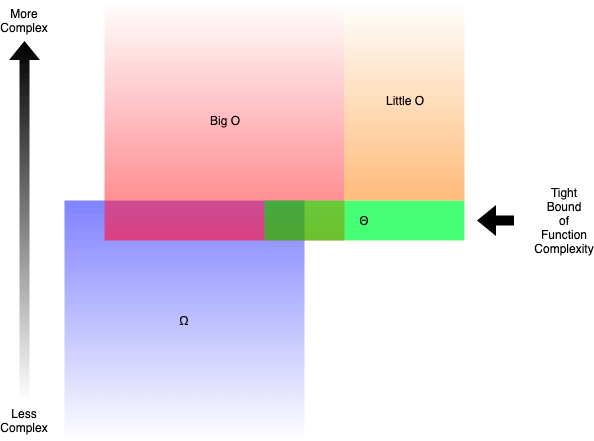
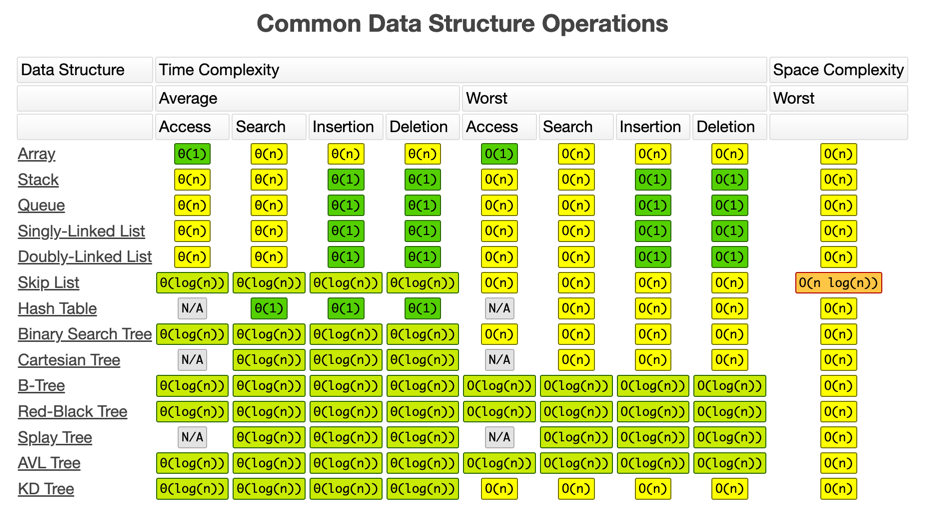

# Algorthm Analysis

Before starting, lets thin about 3 problems:

For an array of size $N$, dont overthink. Just answer:

1. How many iterations a loop run to find a specific number inside an array? (naively)
2. How many comparisons should I make to find two numbers in an array that sum a specific target? (naively)
3. List all different shuffled arrays we can make? (naively) ex for n==3 123, 132, 213, 231, 312, 321

## How to measure an algorithm mathematically?

???+ example "find a number in a vector"

    ```c++
    int find(vector<int> v, int target) {
        // how many iterations?
        for (int i = 0; i < v.size(); i++) {
            // how many comparisons?
            if (v[i] == target) { 
            return i;
            }
        }
        return -1;
    }
    ```

???+ example "find two numbers sum in an array"

    ```c++
    vector<int> findsum2(vector<int> v, int target) {
        // how many outer loop iterations?
        for (int i = 0; i < v.size(); i++) {
            // how many inner loop iterations?
            for (int j = i+1; j < v.size(); j++) {
                // how many comparisons?
                if (v[i] + v[j] == target) {
                    return {i, j};
                }
            }
        }
        return {-1, -1};
    }
    ```
    Check it out on [leetcode](https://leetcode.com/problems/two-sum/description/). Can you solve it better?

???+ example "Print all pormutations of an array"

    ```c++
    void generatePermutations(std::vector<int>& vec, int index) {
        if (index == vec.size() - 1) {
            // Print the current permutation
            for (int num : vec) {
                std::cout << num << " ";
            }
            std::cout << std::endl;
            return;
        }
        
        // how many swaps for every recursive call?
        for (int i = index; i < vec.size(); ++i) { 
            // Swap the elements at indices index and i
            std::swap(vec[index], vec[i]);

            // Recursively generate permutations for the rest of the vector
            // How deep this can go?
            generatePermutations(vec, index + 1);

            // Backtrack: undo the swap to explore other possibilities
            std::swap(vec[index], vec[i]);
        }
    }
    ```

Trying to be mathematicaly correct, the number of instructions the first one should be a function similar to this:

1. $f(n) = a*n + b$ : Where $b$ is the cost of what runs before and after the main loop and $a$ is the cost of the loop.
2. $f(n) = a*n^2 + b*n + c$ : Where $c$ is the cost of what runs before and after the oter loop; $b$ is the cost of the outer loop; and $a$ is the cost of the inner loop;
3. $f(n) = a*n!$ : Where $a$ is the cost of what runs before and after the outer loop;

To simplify, we remove the constants and the lower order terms:

1. $f(n) = n$
2. $f(n) = n^2$
3. $f(n) = n!$

## Difference between Big O vs Big Theta Θ vs Big Omega Ω Notations

<figure markdown>
  
  <figcaption>Source: bigocheatsheet.com</figcaption>
</figure>

### Big O

- Most used notation;
- Upper bound;
- "never worse than";
- A real case cannot be faster than it;
- $0 <= func <= O$

### Big Theta Θ

- Wrongly stated as average;
- Theta is two-sided;
- Tight bound between 2 constants of the same function 
- $k1*Θ <= func <= k2*Θ$
- When $N$ goes to infinite, it cannot be faster or slower than it;

### Honorable mentions

- **Big Omega Ω**: roughly the oposite of Big O;
- **Little o** and **Little Omega (ω)**. The same concept from the big, but exclude the exact bound;

<figure markdown>
  
  <figcaption>Source: freecodecamp.com</figcaption> 
</figure>

## Common Big Os

!!! note inline end "Logarithm"
    
    In computer science, when we say log, assume base 2, unless expressely stated;

| Big O | Name | Example |
| --- | --- | --- |
| O(1) | Constant | sum two numbers |
| O(lg(n)) | Logarithmic | binary search |
| O(n) | Linear | search in an array |
| O(n*lg(n)) | Linearithmic | Merge Sort |
| O(n^c) | Polinomial | match 2 sum |
| O(c^n) | Exponential | brute force password of size n |
| O(n!) | factorial | list all combinations |

### What is logarithm?

Log is the inverse of exponentiation. It is the number of times you have to multiply a number by itself to get another number.

$$ log_b(b^x) = x $$

### What is binary search?

In a binary search, we commonly divide the array in half (base 2), and check if the target is in the left or right half. Then we repeat the process until we find the target or we run out of elements.

<figure markdown>
  
  <figcaption>Source: mathwarehouse.com</figcaption>
</figure>

## Common data structures and algorithms

<figure markdown>
  
  <figcaption>Source: bigocheatsheet.com</figcaption> 
</figure>

<figure markdown>
  
  <figcaption>Source: bigocheatsheet.com</figcaption> 
</figure>

## Common Issues and misconceptions

- Big O and Theta are commonly mixed;
- Hashtables: it is commonly assumed that queries on `<map>` or `<set>` being `O(1)`; std:: `<map>` and `<set>` are not the ideal implementation! [Watch this CppCon video](https://www.youtube.com/watch?v=ncHmEUmJZf4) for some deep level insights;
