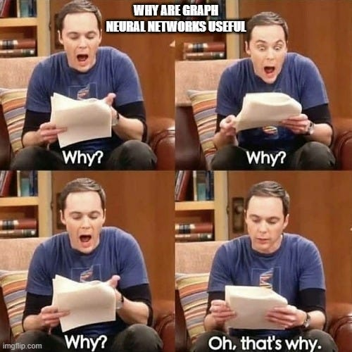

# Graph

Graphs are a type of data structures that interconnects nodes (or vertices) with edges. They are used to model relationships between objects. This is the basics for most AI algorithms, such as pathfinding, decision making, neuron networks, and others.



## Basic Definitions

- **Nodes or vertices** are the basic entities in a graph and hold the data. 
- **Edges** are the connections and relation between the nodes. The relationship can be enriched in multiple ways such as direction, weight, and others. 
- **Neighbours** are the nodes that are connected to a specific node.
- **Path** is the sequence of edges and nodes that allows you to go from one node to another.
- **Degree** of a node is the number of edges connected to it.


## Representation

A graph is composed by a set of vertices(nodes) and edges. There are multiple ways to represent a graph, and every style has its own advantages and disadvantages.

### Adjacency matrix

Assuming every node is labeled with a number from `0` to `n-1`, an adjacency matrix is a 2D array of size `n` x `n`. The entry `a[i][j]` is 1 if there is an edge from node i to node j, and 0 otherwise. The adjacency matrix for a graph is always a square matrix.

```c++
// adjacency matrix
// NUMBER_OF_NODES is the number of nodes
// bool marks if there is an edge between the nodes.
// switch bool to float if you want to store the weight of the edge.
// switch bool to a data structure if you want to store more information about the edge.
bool adj_matrix[NUMBER_OF_NODES][NUMBER_OF_NODES];
vector<Node> nodes;
```

- **Pros**: it is simple and easy to implement and blazing fast for checking if there is an edge between two nodes. 
- **Cons**: it consumes a lot of space, especially for sparse graphs.

### Adjacency list

It can be implemented in multiple ways, but a common one is to use an array of lists(or vectors). The index(key) of the array is the node id, and the value is a list of nodes that are connected to the key node.

```c++
// adjacency list
// NUMBER_OF_NODES is the number of nodes
// vector for storing the connected nodes ids as integers
// switch vector<int> to map<int, float> if you want to store the weight of the edge.
// switch map<int, float> to map<int, data_structure> if you want to store more information about the edge.
vector<int> adj_list[NUMBER_OF_NODES];
vector<Node> nodes;
```

- **Pros**: it is more memory efficient for sparse graphs.
- **Cons**: it can be slower to check if there is an edge between two nodes.

### Edge list

It is a collection of edges, where each egge can be represented as a pair of nodes, a pair of node ids, or a pair of references to nodes.  

```c++
// edge list
vector<pair<int, int>> edges;
vector<Node> nodes;
```

- **Pros**: it is the most memory efficient representation for sparse graphs.
- **Cons**: it can be slower to check if there is an edge between two nodes.

## Graph Types

- **Null graph**: A graph with no edges.
- **Trivial graph**: A graph with only one vertex.
- **Directed graph**: A graph where the edges have direction.
- **Weighted graph**: A graph where the edges have a weight.
- **Undirected graph**: A graph where the edges have no direction or are bidirectional. If weighted, the weights are the same in both directions.
- **Connected graph**: A graph where all nodes can be reached from any other node.
- **Disconnected graph**: A graph where some nodes cannot be reached from other nodes.
- **Cyclic graph**: A graph that has at least one cycle, a path that starts and ends at the same node.
- **Acyclic graph**: A graph that has no cycles.
- **Complete graph**: A graph where every pair of nodes is connected by a unique edge.
- **Regular graph**: A graph where every node has the same degree.


## Graph Algorithms

### Depth-First Search (DFS)

DFS is a graph traversal algorithm based on a stack data structure. Basically, the algorithm starts at a node and explores as far as possible along each branch before backtracking. It is used to find connected components, determine the connectivity of the graph, and solve many other problems.

<a href="https://www.cs.usfca.edu/~galles/visualization/DFS.html">DFS visualization</a>

```c++
#include <iostream>
#include <vector>
#include <unordered_set>
#include <unordered_map>
#include <string>

// graph is represented as an adjacency list
std::unordered_map<std::string, std::unordered_set<std::string>> graph;
std::unordered_set<std::string> visited;

// dfs recursive version
// it exploits the call stack to store the nodes to visit
// you might want to use the iterative version if you have a large graph
// for that, use std::stack data structure and producer-consumer pattern
void dfs(const std::string& node) {
  std::cout << node << std::endl;
  visited.insert(node);
  for (const auto& neighbor : graph[node])
    if (!visited.contains(neighbor))
      dfs(neighbor);
}

void dfs_interactive(const std::string& node) {
  std::stack<std::string> stack;
  // produce the first node
  stack.push(node);
  while (!stack.empty()) {
    // consume the node
    std::string current = stack.top();
    stack.pop();
    // avoid visiting the same node twice
    if (visited.contains(current))
      continue;
    // mark as visited
    visited.insert(current);

    // visit the node
    std::cout << current << std::endl;
    
    // produce the next node to visit
    for (const auto& neighbor : graph[current]) {
      if (!visited.contains(neighbor)) {
        stack.push(neighbor);
        break; // is this break necessary?
      }
    }
  }
}

int main() {
  std::cout << "Write one node string per line. When you are done, add an empty line." << std::endl;
  std::string node;
  while (std::getline(std::cin, node) && !node.empty())
    graph[node] = {};
  std::cout << "Write the edges as 'node1;node2'. When you are done, add an empty line." << std::endl;
  std::string edge;
  while (std::getline(std::cin, edge) && !edge.empty()) {
    auto pos = edge.find(';');
    // Bidirectional
    std::string source = edge.substr(0, pos);
    std::string destination = edge.substr(pos + 1);
    graph[source].insert(destination);
    graph[destination].insert(source);
  }
  std::cout << "Write the starting node." << std::endl;
  std::string start;
  std::cin >> start;
  dfs(start);
  return 0;
}
```

### Breadth-First Search (BFS)

BFS is a graph traversal algorithm based on a queue data structure. It starts at a node and explores all of its neighbours before moving on to the next level of neighbours by enqueing them. It is used to find the shortest path, determine the connectivity of the graph, and others.

<a href="https://www.cs.usfca.edu/~galles/visualization/BFS.html">BFS visualization</a>

```c++
#include <iostream>
#include <vector>
#include <unordered_set>
#include <unordered_map>
#include <string>
#include <queue>

// graph is represented as an adjacency list
std::unordered_map<std::string, std::unordered_set<std::string>> graph;
std::unordered_set<std::string> visited;

// bfs
void bfs(const std::string& node) {
  std::queue<std::string> queue;
  // produce the first node
  queue.push(node);
  while (!queue.empty()) {
    // consume the node
    std::string current = queue.front();
    queue.pop();
    // avoid visiting the same node twice
    if (visited.contains(current))
      continue;
    // mark as visited
    visited.insert(current);

    // visit the node
    std::cout << current << std::endl;

    // produce the next node to visit
    for (const auto& neighbor : graph[current]) {
      if (!visited.contains(neighbor))
        queue.push(neighbor);
    }
  }
}

void dfs_interactive(const std::string& node) {
  std::stack<std::string> stack;
  // produce the first node
  stack.push(node);
  while (!stack.empty()) {
    // consume the node
    std::string current = stack.top();
    stack.pop();
    // avoid visiting the same node twice
    if (visited.contains(current))
      continue;
    // mark as visited
    visited.insert(current);

    // visit the node
    std::cout << current << std::endl;

    // produce the next node to visit
    for (const auto& neighbor : graph[current]) {
      if (!visited.contains(neighbor)) {
        stack.push(neighbor);
        break; // is this break necessary?
      }
    }
  }
}

int main() {
  std::cout << "Write one node string per line. When you are done, add an empty line." << std::endl;
  std::string node;
  while (std::getline(std::cin, node) && !node.empty())
    graph[node] = {};
  std::cout << "Write the edges as 'node1;node2'. When you are done, add an empty line." << std::endl;
  std::string edge;
  while (std::getline(std::cin, edge) && !edge.empty()) {
    auto pos = edge.find(';');
    // Bidirectional
    std::string source = edge.substr(0, pos);
    std::string destination = edge.substr(pos + 1);
    graph[source].insert(destination);
    graph[destination].insert(source);
  }
  std::cout << "Write the starting node." << std::endl;
  std::string start;
  std::cin >> start;
  // dfs(start);
  dfs_interactive(start);
  return 0;
}
```

 [source](https://www.deviantart.com/eleew/art/Carl-Graph-Theory-D8-208366409)


https://www.redblobgames.com/pathfinding/grids/graphs.html

https://www.redblobgames.com/pathfinding/a-star/introduction.html

https://qiao.github.io/PathFinding.js/visual/