# Minimum Spanning Tree

Jarnik's(and Prim's) developed the Minimum Spanning Tree, it is an algorithm to find a tree in a graph that connects all the vertices with the minimum possible accumulated weight.

The output of the algorithm is a set of edges that the sum of the weighs is the minimum possible and connects all reachable vertices.

## Minimum Spanning Tree Algorithm

- Add a vertex to the minimum spanning tree;
- While all nodes are not in the minimum spanning tree:
    - Find the edge with the minimum weight that connects a vertex in the MST to a vertex not in the MST;
    - Add the vertex from that edge to the MST;

<p><a href="https://commons.wikimedia.org/wiki/File:PrimAlgDemo.gif#/media/File:PrimAlgDemo.gif"></a> 

By <a href="//commons.wikimedia.org/wiki/User:Shiyu_Ji" title="User:Shiyu Ji">Shiyu Ji</a> - <span class="int-own-work" lang="en">Own work</span>, <a href="https://creativecommons.org/licenses/by-sa/4.0" title="Creative Commons Attribution-Share Alike 4.0">CC BY-SA 4.0</a>, <a href="https://commons.wikimedia.org/w/index.php?curid=54420894">Link</a></p>

## Example

Let's consider the following graph:

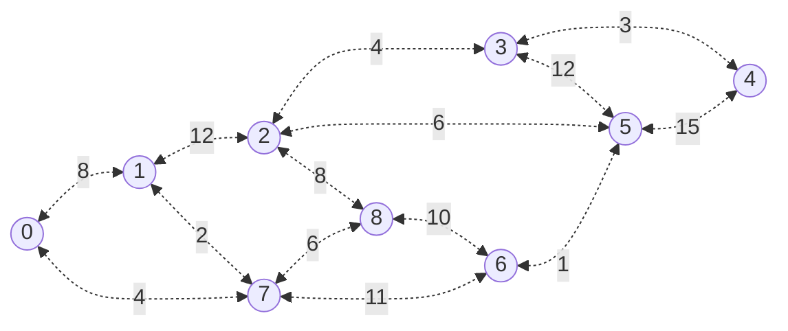

In order to bootstrap the algorithm we need to:

- Select a random vertex;
    - let's choose the vertex 0; 
- Add the vertex 0 to minimum spanning tree;
    - Add all edges that connect the vertex 0 to the priority queue, we add 1 with the weight of 8 and 7 with the weight of 4;

Current state of data:

- Minimum Spanning Tree: {0}

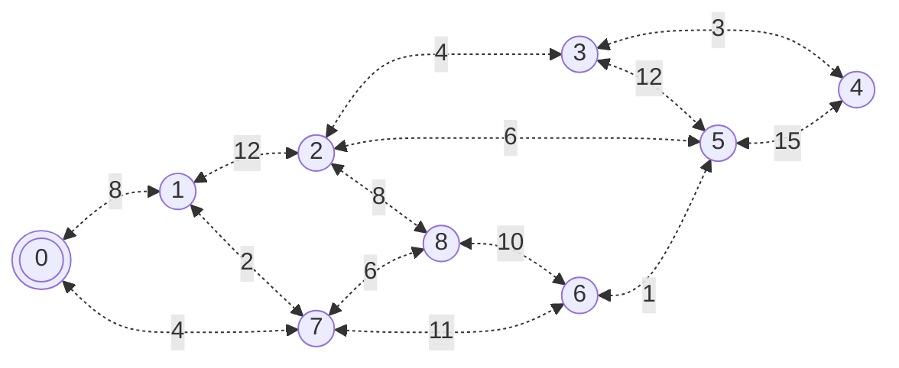

After the initial setup, we will start running the producer-consumer loop:

1. List all edges from all vertices in the minimum spanning tree where the other vertex is not in the minimum spanning tree;
    - The edges are:
        - {0, 1} with the weight of 8;
        - {0, 7} with the weight of 4;

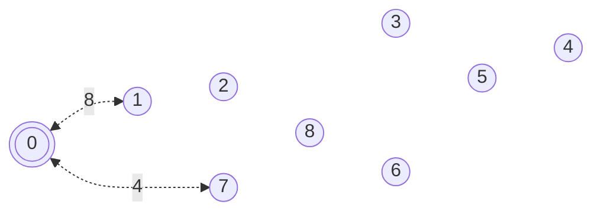

2. Select the edge with the minimum weight;
    - The edge {0, 7} with the weight of 4; 

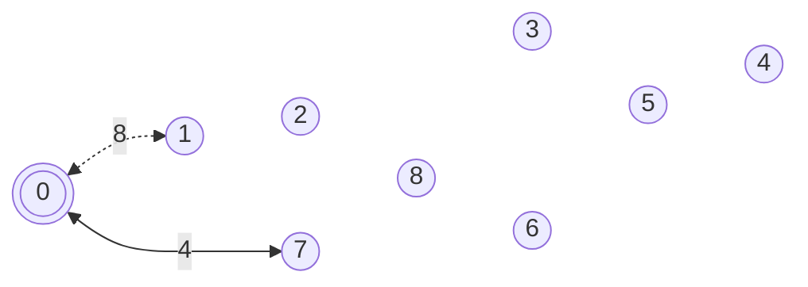

3. From the selected edge, add the other vertex to the minimum spanning tree
    - Add the vertex 7 to the minimum spanning tree;

The current state of the minimum spanning three is `[{0, 7}]`.;

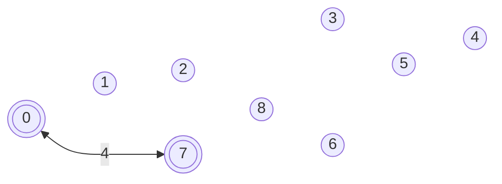

Let's repeat the process once more to illustrate the algorithm:

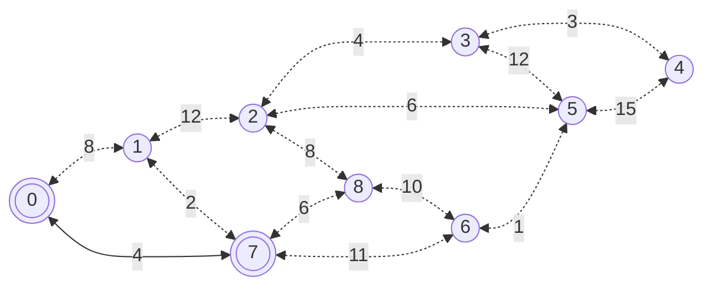

1. List all edges from all vertices in the minimum spanning tree where the other vertex is not in the minimum spanning tree;
    - The edges are:
        - {0, 1} with the weight of 8;
        - {7, 1} with the weight of 2;
        - {7, 8} with the weight of 6;
        - {7, 6} with the weight of 11;

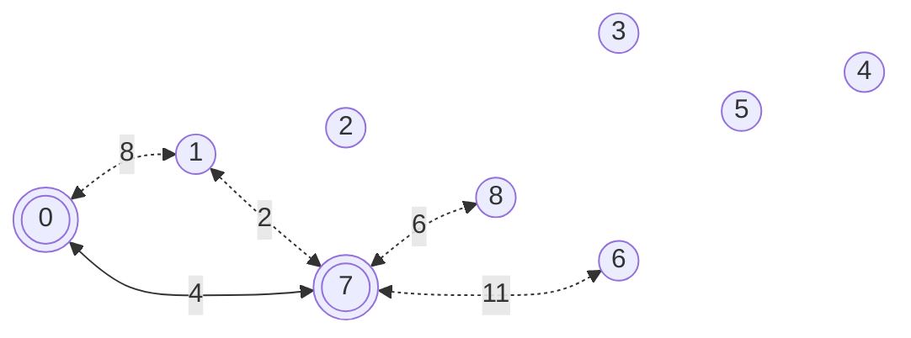

2. Select the edge with the minimum weight;
    - The edge {7, 1} with the weight of 2;
3. From the selected edge, add the other vertex to the minimum spanning tree
    - Add the vertex 1 to the minimum spanning tree;

The current state of the minimum spanning three is `[{0, 7}, {1, 7}]`.

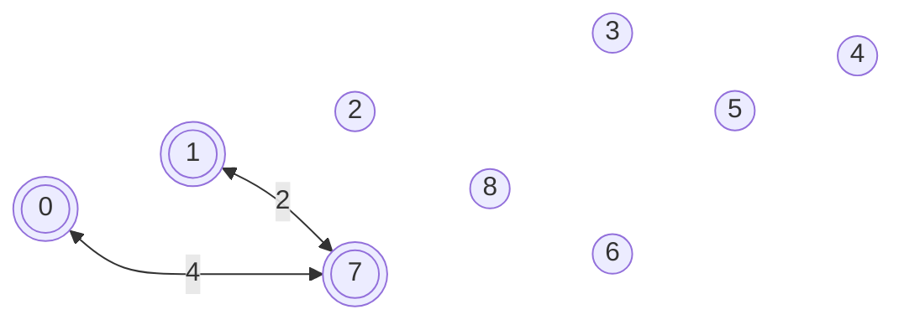

Now the current exploration state is:

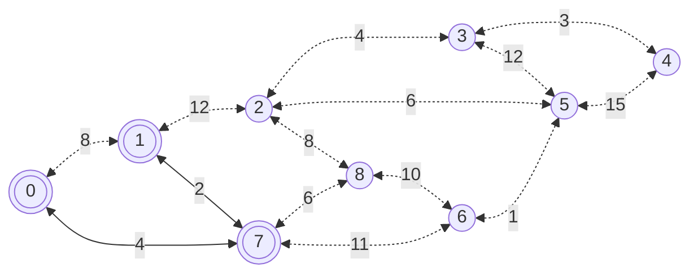

The edges candidates are: 

- {0, 1}: 12;
- {7, 8}: 6;
- {7, 6}: 11;

The edge with the minimum weight is {7, 8}: 6. So we will add 8 to the minimum spanning tree.

The current state of the minimum spanning three is `[{0, 7}, {1, 7}, {8, 7}]`.

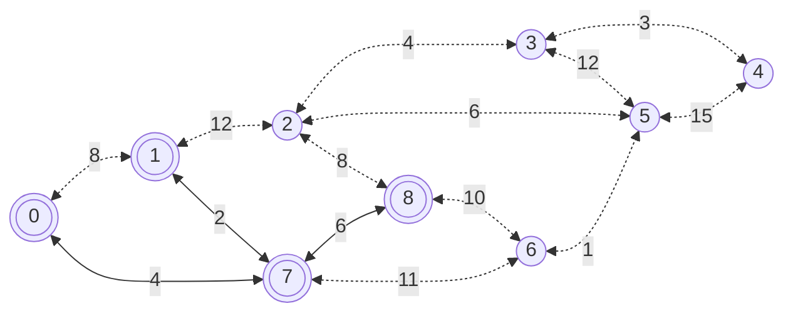

The edges candidates are:

- {1, 2}: 12;
- {8, 2}: 8;
- {8, 6}: 10;
- {7, 6}: 11;

The edge with the minimum weight is {8, 2}: 8. So we will add 2 to the minimum spanning tree.

The current state of the minimum spanning three is `[{0, 7}, {1, 7}, {8, 7}, {2, 8}]`.

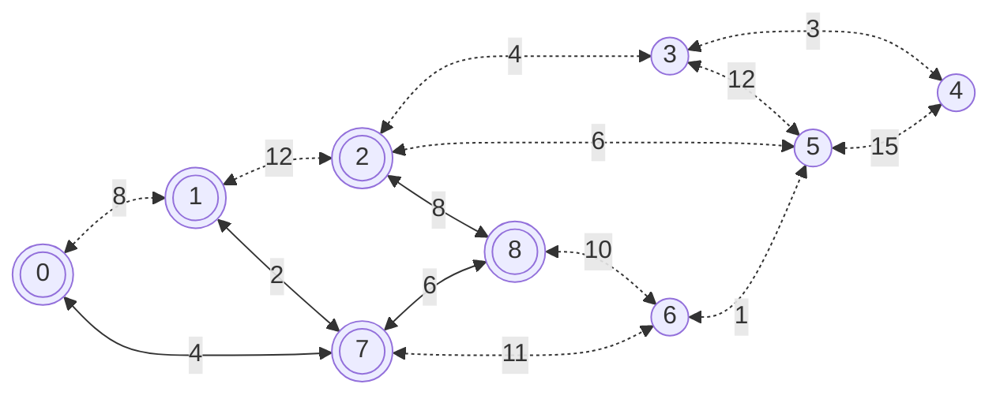

The edges candidates are:

- {2, 3}: 4;
- {2, 5}: 6;
- {8, 6}: 10;
- {7, 6}: 11;

We will add the edge {2, 3}: 4 to the minimum spanning tree.

The minimum spanning three is `[{0, 7}, {1, 7}, {8, 7}, {2, 8}, {3, 2}]`.

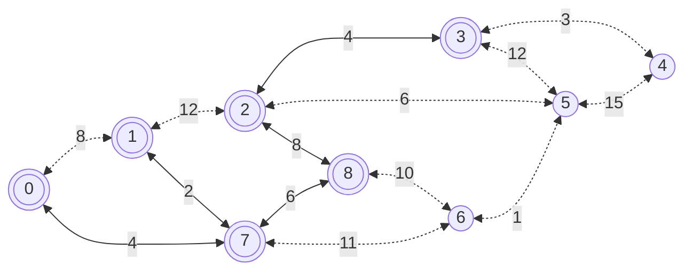

Candidates:

- {3, 4}: 3;
- {3, 5}: 12;
- {2, 5}: 6;
- {8, 6}: 10;
- {7, 6}: 11;

The edge with the minimum weight is {3, 4}: 3. So we will add 4 to the minimum spanning tree.

The minimum spanning three is now `[{0, 7}, {1, 7}, {8, 7}, {2, 8}, {3, 2}, {4, 3}]`.

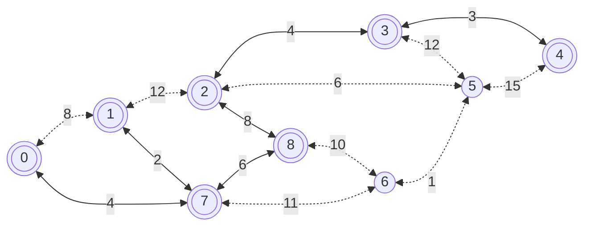

The egdes candidates are:

- {3, 5}: 12;
- {2, 5}: 6;
- {4, 5}: 15;
- {8, 6}: 10;
- {7, 6}: 11;

Select {2, 5}: 6; Add 5 to MST. `[{0, 7}, {1, 7}, {8, 7}, {2, 8}, {3, 2}, {4, 3}, {5, 2}]`.

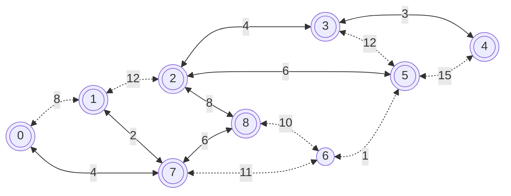

Candidates are:

- {5, 6}: 1;
- {8, 6}: 10;
- {7, 6}: 11;

Select {5, 6}: 1; Add 6 to MST. `[{0, 7}, {1, 7}, {8, 7}, {2, 8}, {3, 2}, {4, 3}, {5, 2}, {6, 5}]`.

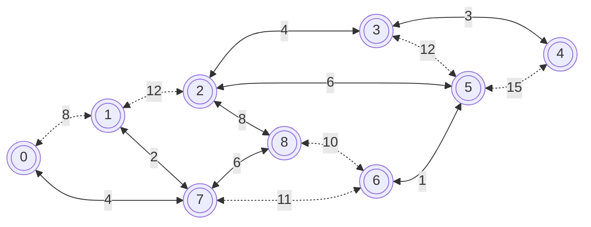

Now, our current MST does not any candidates to explore, so the algorithm is finished. The minimum spanning tree is `[{0, 7}, {1, 7}, {8, 7}, {2, 8}, {3, 2}, {4, 3}, {5, 2}, {6, 5}]`.

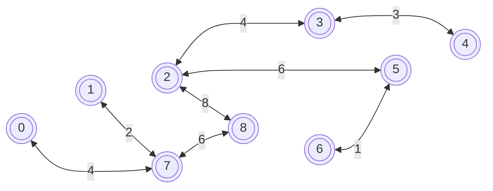

The total weight of the minimum spanning tree from `{0, 7}, {1, 7}, {8, 7}, {2, 8}, {3, 2}, {4, 3}, {5, 2}, {6, 5}` is `4 + 2 + 6 + 8 + 4 + 3 + 6 + 1 = 34`.

## Implementation

There are many implementations for the Minimum Spanning Tree algorithm, here goes one possible implementation `int` as key, `int` as value and `int` as weight: 

```c++
#include <iostream>
#include <unordered_set>
#include <unordered_map>
#include <optional>
#include <tuple>
#include <vector>
#include <utility>
using namespace std;

// rename optional<tuple<int, int, int>> to edge
typedef optional<tuple<int, int, int>> Edge;

// rename unordered_map<int, unordered_map<int, int>> to Graph
typedef unordered_map<int, unordered_map<int, int>> Graph;

// source, destination, weight
Edge findMinEdge(const Graph& graph, const Graph& mst){
  if(graph.empty())
    return nullopt;
  if(mst.empty()){
    // select a random node to start, we will get the first vertex
    int source = graph.begin()->first;
    // candidates to be destination
    auto candidates = graph.at(source);
    // iterator
    auto it = candidates.begin();
    // best destination and weight
    int bestDestination = it->first;
    int bestWeight = it->second;
    // iterate over the candidates
    for(; it != candidates.end(); it++){
      if(it->second < bestWeight){
        bestDestination = it->first;
        bestWeight = it->second;
      }
    }
    return make_tuple(source, bestDestination, bestWeight);
  }
  // list all vertices from the minimum spanning tree
  std::unordered_set<int> mstVertices;
  for(auto& [source, destinations] : mst){
    mstVertices.insert(source);
    for(auto& [destination, weight] : destinations){
      mstVertices.insert(destination);
    }
  }
  // iterate over the vertices from the minimum spanning tree to find the minimum edge
  int bestWeight = INT_MAX;
  int bestSource = -1;
  int bestDestination = -1;
  for(auto& source : mstVertices){
    for(auto& [destination, weight] : graph.at(source)){
      if(!mstVertices.contains(destination) && weight < bestWeight){
        bestSource = source;
        bestDestination = destination;
        bestWeight = weight;
      }
    }
  }
  if(bestSource == -1)
    return nullopt;
  return make_tuple(bestSource, bestDestination, bestWeight);
}

// returns the accumulated weight of the minimum spanning tree
// the graph is represented as [source, destination] -> weight
int MSP(const Graph& graph){
  Graph mst;
  int accumulatedWeight = 0;
  while(true){
    auto edge = findMinEdge(graph, mst);
    if(!edge.has_value())
      break;
    auto [source, destination, weight] = edge.value();
    mst[source][destination] = weight;
    mst[destination][source] = weight;
    accumulatedWeight += weight;
  }
  return accumulatedWeight;
}

// minimum spanning tree
int main() {
  return 0;
}
```