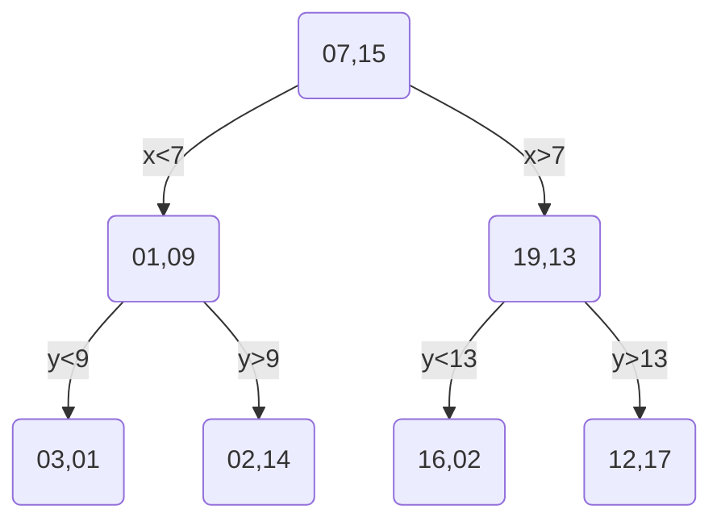

# KD-Trees

KD-Trees are a special type of binary trees that are used to partition a k-dimensional space. They are used to solve the problem of finding the nearest neighbor of a point in a k-dimensional space. The name KD-Tree comes from the method of partitioning the space, the K stands for the number of dimensions in the space.

KD-tree are costly to mantain and balance. So use it only if you have a lot of queries to do, and the space is not changing. If you have a lot of queries, but the space is changing a lot, you should use a different data structure, such as a quadtree or a hash table.

## Methodology

- On the binary tree KD-Tree, each node represents a k-dimensional point;
- The tree is constructed by recursively partitioning the space into two half-spaces. 
- The partitioning is done by selecting a dimension and a value, and then splitting the space into two half-spaces. 
- The dimension and value are selected in such a way that the space is divided into two equal parts. 
- The left child of a node contains all the points for that dimension that are less than the value, and the right child contains all the points that are greater than or equal to the value.

## Example

Let's consider the following 2D points:

```
(3, 1), (7, 15), (2, 14), (16, 2), (19, 13), (12, 17), (1, 9)
```

```vegalite
{
    "$schema": "https://vega.github.io/schema/vega-lite/v4.json",
    "description": "A scatter plot of the points",
    "data": {
        "values": [
        {"x": 3, "y": 1},
        {"x": 7, "y": 15},
        {"x": 2, "y": 14},
        {"x": 16, "y": 2},
        {"x": 19, "y": 13},
        {"x": 12, "y": 17},
        {"x": 1, "y": 9}
        ]
    },
    "mark": "point",
    "encoding": {
        "x": {"field": "x", "type": "quantitative"},
        "y": {"field": "y", "type": "quantitative"}
    }
}
```

The first step is to define the root. For that we need do define two things: the dimension and the value:

- For the dimension we need to select the one that has the largest range. 
- For the value we need to select the median of that dimension.

So if we sort the points by the axis, we will have:

```
SortedByX = (1, 9), (3, 1), (2, 14), (7, 15), (12, 17), (16, 2), (19, 13)
SortedByY = (3, 1), (16, 2), (1, 9), (19, 13), (7, 15), (3, 15), (12, 17)
```

The largest range is on the X axis, so we will select the median of the X axis as the root. The median of the X axis is `(7, 15)`, and the starting dimension will be X.

For the next level, the left side candidates will be the ones with X less than `(7, 15)`, and the right side, the ones that are greater or equal to `(7, 15)`. But now this level will be governed sorted by Y:

```
LeftSortedByY  = (3, 1), (1, 9), (2, 14)
RightSortedByY = (16, 2), (19, 13), (12, 17)
```

Graph showing the first split on X at (7, 15):

The median for the left side is `(1, 9)`, and for the right side is `(19, 13)`.

The current state of the tree is:

```vegalite
{
  "$schema": "https://vega.github.io/schema/vega-lite/v4.json",
  "description": "A scatter plot of the points",
  "encoding": {
    "x": {"field": "x", "type": "quantitative"},
    "y": {"field": "y", "type": "quantitative"}
  },
  "layer": [
    {
      "data": {
        "values": [
          {"x": 3, "y": 1},
          {"x": 7, "y": 15},
          {"x": 2, "y": 14},
          {"x": 16, "y": 2},
          {"x": 19, "y": 13},
          {"x": 12, "y": 17},
          {"x": 1, "y": 9}
        ]
      },
      "mark": "point"
    },
    {
      "data": {
        "values": [
          {"x": 7, "y": 0},
          {"x": 7, "y": 20}
        ]
      },
      "mark": "line",
      "encoding": {
        "color": {
          "value": "#DB745B"
        }
      }
    }
  ]
}
```

Now we apply the same rules for the children of the left and right nodes.



The tree will be:

```vegalite
{
  "$schema": "https://vega.github.io/schema/vega-lite/v4.json",
  "description": "A scatter plot of the points",
  "encoding": {
    "x": {"field": "x", "type": "quantitative"},
    "y": {"field": "y", "type": "quantitative"}
  },
  "layer": [
    {
      "data": {
        "values": [
          {"x": 3, "y": 1},
          {"x": 7, "y": 15},
          {"x": 2, "y": 14},
          {"x": 16, "y": 2},
          {"x": 19, "y": 13},
          {"x": 12, "y": 17},
          {"x": 1, "y": 9}
        ]
      },
      "mark": "point"
    },
    {
      "data": {
        "values": [
          {"x": 7, "y": 0},
          {"x": 7, "y": 20}
        ]
      },
      "mark": "line",
      "encoding": {
        "color": {
          "value": "#DB745B"
        }
      }
    },
    {
      "data": {
        "values": [
          {"x": 0, "y": 9},
          {"x": 7, "y": 9}
        ]
      },
      "mark": "line",
      "encoding": {
        "color": {
          "value": "#4F72DB"
        }
      }
    },
    {
      "data": {
        "values": [
          {"x": 7, "y": 13},
          {"x": 20, "y": 13}
        ]
      },
      "mark": "line",
      "encoding": {
        "color": {
          "value": "#4F72DB"
        }
      }
    }
  ]
}
```

And lastly, we will have:

```vegalite
{
  "$schema": "https://vega.github.io/schema/vega-lite/v4.json",
  "description": "A scatter plot of the points",
  "encoding": {
    "x": {"field": "x", "type": "quantitative"},
    "y": {"field": "y", "type": "quantitative"}
  },
  "layer": [
    {
      "data": {
        "values": [
          {"x": 3, "y": 1},
          {"x": 7, "y": 15},
          {"x": 2, "y": 14},
          {"x": 16, "y": 2},
          {"x": 19, "y": 13},
          {"x": 12, "y": 17},
          {"x": 1, "y": 9}
        ]
      },
      "mark": "point"
    },
    {
      "data": {
        "values": [
          {"x": 7, "y": 0},
          {"x": 7, "y": 20}
        ]
      },
      "mark": "line",
      "encoding": {
        "color": {
          "value": "#DB745B"
        }
      }
    },
    {
      "data": {
        "values": [
          {"x": 0, "y": 9},
          {"x": 7, "y": 9}
        ]
      },
      "mark": "line",
      "encoding": {
        "color": {
          "value": "#4F72DB"
        }
      }
    },
    {
      "data": {
        "values": [
          {"x": 7, "y": 13},
          {"x": 20, "y": 13}
        ]
      },
      "mark": "line",
      "encoding": {
        "color": {
          "value": "#4F72DB"
        }
      }
    },
    {
      "data": {
        "values": [
          {"x": 3, "y": 0},
          {"x": 3, "y": 9}
        ]
      },
      "mark": "line",
      "encoding": {
        "color": {
          "value": "#93DB35"
        }
      }
    },
    {
      "data": {
        "values": [
          {"x": 2, "y": 9},
          {"x": 2, "y": 20}
        ]
      },
      "mark": "line",
      "encoding": {
        "color": {
          "value": "#93DB35"
        }
      }
    },
    {
      "data": {
        "values": [
          {"x": 12, "y": 13},
          {"x": 12, "y": 20}
        ]
      },
      "mark": "line",
      "encoding": {
        "color": {
          "value": "#93DB35"
        }
      }
    },
    {
      "data": {
        "values": [
          {"x": 16, "y": 13},
          {"x": 16, "y": 0}
        ]
      },
      "mark": "line",
      "encoding": {
        "color": {
          "value": "#93DB35"
        }
      }
    }
  ]
}
```

## Implementation

```c++
#include <iostream>
#include <vector>
#include <algorithm>

// vector
struct Vector2f {
    float x, y;
    Vector2f(float x, float y) : x(x), y(y) {}
    // subscript operator to be used in the KDTree
    float& operator[](size_t index) {
        return index%2 == 0 ? x : y;
    }
    // distanceSqrd between two vectors
    float distanceSqrd(const Vector2f& other) const {
        return (x - other.x)*(x - other.x) + (y - other.y)*(y - other.y);
    }
};

// your object data structure
class GameObject {
    // your other data
public:
    Vector2f position;
    explicit GameObject(Vector2f position={0,0}) : position(position) {}
};

// KDNode
struct KDNode {
    GameObject* object;
    KDNode* left;
    KDNode* right;
    KDNode(GameObject* object, KDNode* left = nullptr, KDNode* right= nullptr) :
        object(object),
        left(left),
        right(right)
      {}
};

// KDTree manager
class KDTree {
public:
    KDNode* root;
    KDTree() : root(nullptr) {}

    ~KDTree() {
        // interactively delete the nodes
        std::vector<KDNode*> nodes;
        nodes.push_back(root);
        while (!nodes.empty()) {
            KDNode* current = nodes.back();
            nodes.pop_back();
            if (current->left != nullptr) nodes.push_back(current->left);
            if (current->right != nullptr) nodes.push_back(current->right);
            delete current;
        }
    }

    void insert(GameObject* object) {
        if (root == nullptr) {
            root = new KDNode(object);
        } else {
            KDNode* current = root;
            size_t dimensionId = 0;
            while (true) {
                if (object->position[dimensionId] < current->object->position[dimensionId]) {
                    if (current->left == nullptr) {
                        current->left = new KDNode(object);
                        break;
                    } else {
                        current = current->left;
                    }
                } else {
                    if (current->right == nullptr) {
                        current->right = new KDNode(object);
                        break;
                    } else {
                        current = current->right;
                    }
                }
                dimensionId++;
            }
        }
    }

    void insert(std::vector<GameObject*> objects, int dimensionId=0 ) {
        if(objects.empty()) return;
        if(objects.size() == 1) {
            insert(objects[0]);
            return;
        }
        // find the median for the current dimension
        std::sort(objects.begin(), objects.end(), [dimensionId](GameObject* a, GameObject* b) {
            return a->position[dimensionId] < b->position[dimensionId];
        });
        // insert the median
        auto medianIndex = objects.size() / 2;
        insert(objects[medianIndex]);

        // insert the left and right exluding the median
        insert(std::vector<GameObject*>(objects.begin(), objects.begin() + medianIndex), (dimensionId + 1) % 2);
        insert(std::vector<GameObject*>(objects.begin() + medianIndex + 1, objects.end()), (dimensionId + 1) % 2);
    }

    // get the nearest neighbor
    GameObject* nearestNeighbor(Vector2f position) {
        return NearestNeighbor(root, position, root->object, root->object->position.distanceSqrd(position), 0);
    }

    GameObject* NearestNeighbor(KDNode* node, Vector2f position, GameObject* best, float bestDistance, int dimensionId) {
        // create your own Nearest Neighbor algorithm. That's not hard, just follow the rules
        // 1. If the current node is null, return the best
        // 2. If the current node is closer to the position, update the best
        // 3. If the current node is closer to the position than the best, search the children
        // 4. If the current node is not closer to the position than the best, search the children
        // 5. Return the best
    }

    // draw the tree
    void draw() {
        std::vector<KDNode*> nodes;
        // uses space to shaw the level of the node
        std::vector<std::string> spaces;
        nodes.push_back(root);
        spaces.push_back("");
        while (!nodes.empty()) {
            KDNode* current = nodes.back();
            std::string space = spaces.back();
            nodes.pop_back();
            spaces.pop_back();
            if (current->right != nullptr) {
                nodes.push_back(current->right);
                spaces.push_back(space + "  ");
            }
            std::cout << space << ":> " << current->object->position.x << ", " << current->object->position.y << std::endl;
            if (current->left != nullptr) {
                nodes.push_back(current->left);
                spaces.push_back(space + "  ");
            }
        }
    }
};

int main(){
    // nodes: (3, 1), (7, 15), (2, 14), (16, 2), (19, 13), (12, 17), (1, 9)
    KDTree tree;
    std::vector<GameObject*> objects = {
        new GameObject(Vector2f(3, 1)),
        new GameObject(Vector2f(7, 15)),
        new GameObject(Vector2f(2, 14)),
        new GameObject(Vector2f(16, 2)),
        new GameObject(Vector2f(19, 13)),
        new GameObject(Vector2f(12, 17)),
        new GameObject(Vector2f(1, 9))
    };
    // insert the objects
    tree.insert(objects);
    // draw the tree
    tree.draw();
    // get the nearest neighbor to (10, 10)
    GameObject* nearest = tree.nearestNeighbor(Vector2f(3, 15));
    std::cout << "Nearest neighbor to (3, 15): " << nearest->position.x << ", " << nearest->position.y << std::endl;
    // will print 2, 14
    return 0;
}
```

## Homework

1. Implement the KDTree in your favorite language;
2. Improve the KDTree to support 3D;
3. Implement more methods to make it dynamic: insert, remove, update;
4. Modify the KDTree to be balanced on insertion;
