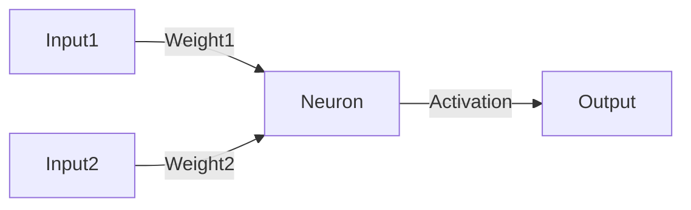
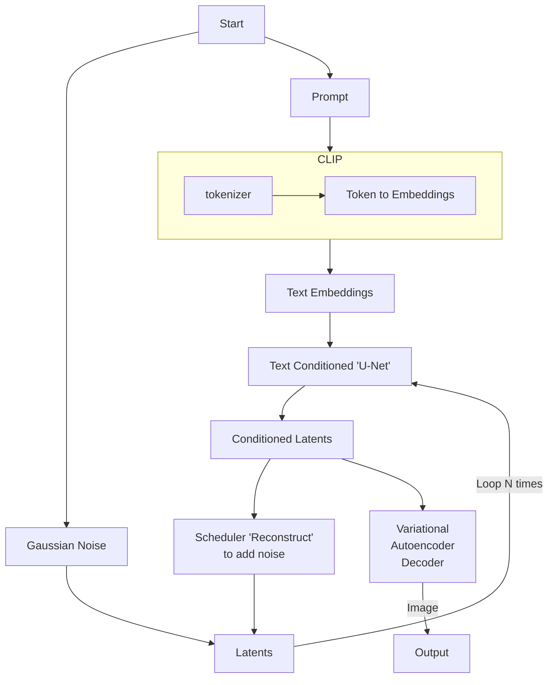

# Stable Diffusion

## Introduction

The steps to understand GenAI are as follows:

1. Artificial Neurons, types of neurons, and activation functions
2. Networks of Neurons, topology, and training
3. Stable Diffusion

## TLDR;

1. Install the latest Python. Add it to the environment PATH. [Windows:] Install directly to C drive and select the 3.10.6 version of python, install for all users;
2. Download latest release from [Automatic1111](https://github.com/AUTOMATIC1111/stable-diffusion-webui) or clone the repository. Clone/Download it to a subfolder on C drive. Dont use your personal folder.;
3. Unzip the release. Run the `webui` bash file [Windows:] `webui.bat`;
4. Select a bunch of the images that you are willing to train the network with;
5. Go to `train` tab and create a tag for your embeddings;
6. Use your tag to generate a new image;

Extras:

1. Go to [Hugging face](https://huggingface.co/) and download 2 Stable Diffusion models. They should be compatible (ex. both should be v2.1 or 1.5).;
2. Go to checkpoin merger, and merge two or more models.

## Artificial Neurons

Artificial neurons are the basic building blocks of neural networks and all the other Generative AI algorithms. Neuron networks are composed by:

- **Inputs**: The inputs are the data that the network will process. They are the data that the network will use to make decisions. In the case of the neural networks, the inputs are the data that will be processed by the neurons.
- **Weights**: The weights are the parameters that the network will learn. They are the parameters that the network will use to make decisions. In the case of the neural networks, the weights are the parameters that will be learned by the neurons.
- **Functions**: summing, activation and bias.
    - **Summing**: The summing function is the function that will sum the inputs and the weights.
    - **Activation**: The activation function is the function that will decide if the neuron will fire or not or how it will fire or propagate.
    - **Bias**: The bias is a weight that will be added to the summing function.
- **Output**: The output is the result of the neuron. It can be used to feed another neuron or to be the final result of the network.

Depending on how the neuron activates, which math operator it uses to sum the inputs and the weights, and how it propagates the output, the neuron can be classified as: **Linear**, **Binary**, **Sigmoid**, **Tanh**, and many others that follow math functions to combine data and propagate the output.

## Topologies

[Material](https://docs.google.com/presentation/d/1CxUViO-yCanrzCcJZ5OGicYcSkzo21FzJZ_2rnKJh7k/edit?usp=sharing)

## Generative AI

Generative AI is the new trend in AI. It is the field of AI that is focused on creating new data from existing data using neural networks and other algorithms. Here we will focus on the Stable Diffusion ones.

Stable diffusion pipeline:

