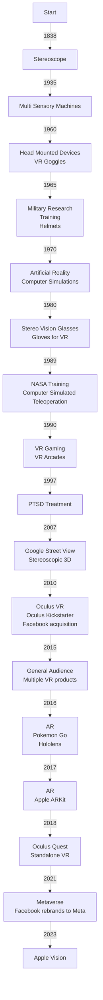
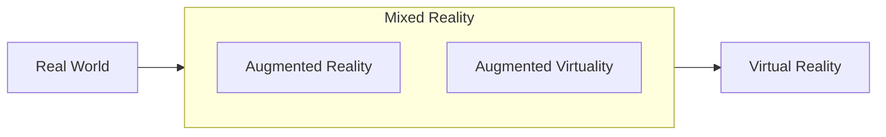

# Let's talk about Virtual Reality

The goal of this article is not be a comprehensive guide about Virtual Reality, but to give you a general sense of what it is and how it works. I will also give you some examples of how it is being used today and what we can expect for the future.

<!-- more -->

[//]: # (ToDo: add image here, add summary )

## History

As you can see the history of VR is quite long and full of interesting surprising developments, but it is only in the last 10 years that it has become a reality for the general audience.

## Terms Disambiguation

Before we go any further, let's disambiguate some terms that are often used interchangeably. Nowadays we have a spectrum of immersive technologies that goes from the real world to the virtual world.

### Virtual Reality

Virtual Reality (VR) is the most pervasive and ambiguous term. It is sometimes used as an umbrella for all immersive technologies, but it is more commonly used to refer to the process of simulating a virtual world that is completely isolated the user from the real world. This is usually done by using a Head Mounted Display (HMD) that blocks the user's view of the real world and replaces it with a simulation in front of the user's eyes; and headphones to replace the real sounds with virtual. The user can also use controllers to interact in it.

This term gained lots of attention with the modern VR boom that started in 2010 with the Oculus Kickstarter campaign followed by its acquisition by Facebook in 2014. After that, many other companies started to develop their own VR products, such as the HTC Vive, the Playstation VR, and the Samsung Gear VR.

### Augmented Reality

Augmented Reality is another ambiguous term, but its meaning is more settled. It refers to the process of adding computer generated elements to the real world. It can be done by using a Head Mounted Display (HMD) that allows the user to see the real world and the virtual elements at the same time such as Google Glass or the Microsoft Hololens. It can also be done by using a smartphone or tablet that uses the camera to capture the real world and then adds virtual elements to it. This is the case of the Snapchat filters and the popular game Pokemon Go launched in 2016.

### Augmented Virtuality

This term usually is not misused and more specifically refers to the process of adding real world elements to a virtual world. It can appears in many forms, for example, the use of a treadmill to simulate walking in the virtual world or the use of a camera to capture the user's face and add it to the virtual world. Stereocameras or depth sensors are also used to capture the user's hands and add them to the virtual world as well.

Most of the time Augmented Virtuality (AV) is seen as an enhancement to the already existing immersive experience. It can be used to add another level of realism to the virtual world, to make the user feel more immersed in it, reduce nausea, or discomfort by adding real world anchors to the virtual world.

## Challenges

In order to make immersive gadgets a reality, we need to overcome some challenges. The most important ones are:

- Motion Sickness: the feeling of nausea and discomfort caused by the mismatch between the user's movements and the virtual world. It is mostly caused by:
    - Latency: the time it takes for the system to react to the user's actions. The system needs to process the inputs, accelerometers, gyroscopes, and other sensors, and then render the new image to the user. This process takes time and if it is too long the user will feel unresponsiveness and will get sick; 
    - Field of View: the area that the user can see at any given time doesnt match the area that the user can see in the real world;
    - Resolution: the number of pixels that the user can see at any given time. Ex. The Oculus Rift DK1 had a resolution of 640x800 per eye that was zoomed to cover the user's entire field of view, and on top of that, the spacing between pixels makes the image looks like a grid of squared dots; you can see why it received so many complaints;
    - Tracking: the ability of the system to track the user's movements properly. The sensors usually do not refresh at the same rate as the display, so the system needs to interpolate the user's movements between the sensor readings. This can cause the user to feel like the virtual world is lagging behind the real world and be out of sync with the user's movements;
- Comfort: the feeling of comfort that the user has while using the system. If the device needs to be worn for a long period of time, right weight distribution, padding, and ventilation are important to make the user feel comfortable;
- Cost: the cost of the system. The machinery and technology used to create the system can be very expensive to be accessible to the general audience;
- Portability: the ability of the system to be used in different places. If the system is too heavy or too big it will be hard to carry; 
- Social Acceptance: the acceptance of the system by the society. If the system is too intrusive or too weird it will be hard to use in public places. It could be seen as a threat to privacy or as a threat to the user's safety;
- Battery Life: the amount of time that the system can be used without being plugged in. If the system needs to be plugged in all the time it will be hard to use in public places;
- Software Development Kits: the tools that developers use to create applications for the system. If the SDK is too hard to use or too limited it will be hard to create applications for the system;

I will add to this list a personal experience that I don't see many people talking about: bad smell, oily foams, and connectors corrosion. The root of those problems is the proximity with the user's face. The user's face is a very oily place and the foam that is used to make the device comfortable is an exceptional place for bacteria to grow. The connectors are also exposed to the user's sweat and can corrode over time and brick your device.

## Applications

There are virtually infinite applications for immersive technologies, but I will focus on the ones that I think are the most important ones in my opinion:

- Entertainment: Games in general, but also movies, etc.;
- Data Visualization: the ability to visualize data in a 3D space can be very useful to understand complex data;
- Education: Training, virtual classrooms, virtual museums, virtual tours, etc.;
- Social: Virtual meetings, parties, dating, etc.;
- Psychological Treatment: Virtual exposure therapy(Ex.: PTSD, phobias), virtual reality therapy, etc.;
- Medical: Surgery planning, surgery simulation, etc.;
- Design: Architecture, interior design, etc.; 

## Future

In my past, I have created a startup to help surgeons plan their surgeries and ported it to VR - [DocDo](https://www.docdo.com.br). I created some small scoped projects to psychological treatment via progressive exposition, some for data visualization and others for education. I am not in position to have a strong opinion about the future of VR, but I can share my thoughts about it.

At the beginning of the metaverse boom, I was very skeptical about it, and I am still. I felt it was a just a new interpretation of a product previously tested on Second Life and proved to be a niche product, focused in being fun, but forcing the use of device with many issues. Another problem was the lack of a real application besides the fun factor.

As a developer, I am in love with Apple's new Vision OS emulator and SDK. It is surprisingly easy to use, filled with useful functions, although it is buggy and crashes randomly in beta channel that I am using now. I think it is an exceptional example of how to create a nice SDK for a new platform. I am not sure if it will be a success, but I am sure that it will empower many developers to create new or port existing applications to their platform. They have created a simply way to bring a desktop experience to a VR gadget that just work. You can "easily" port your app to it and it will work. It is portable, easy to code, powerful hardware, nice battery life, and a nice SDK. I think it is a nice recipe for success. My only concern is related to the cost and social acceptance.