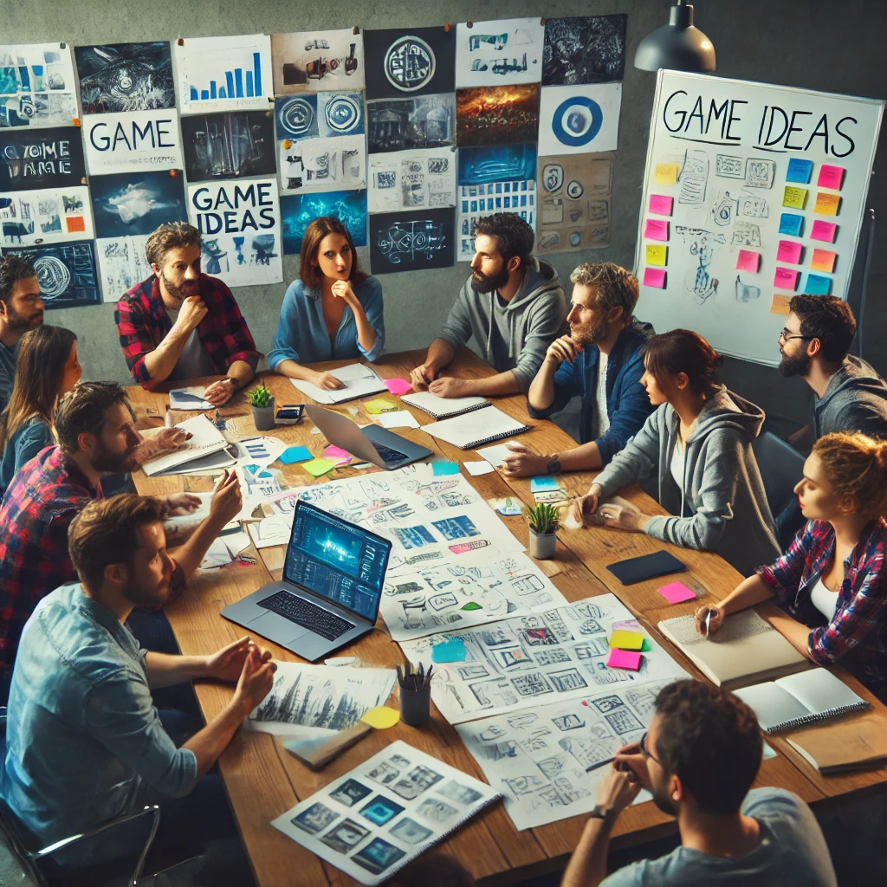
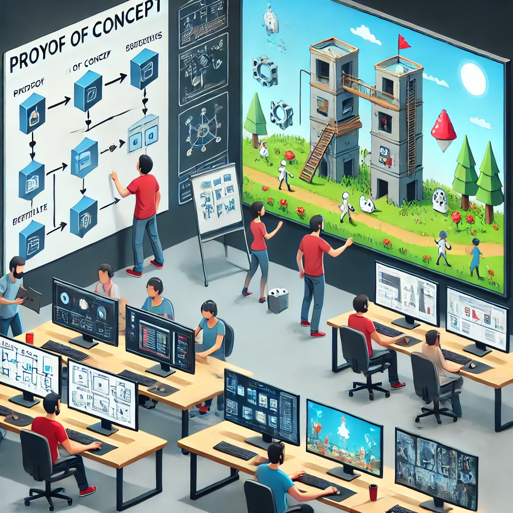
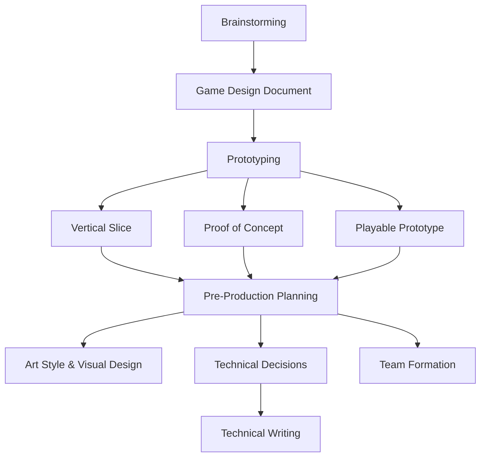
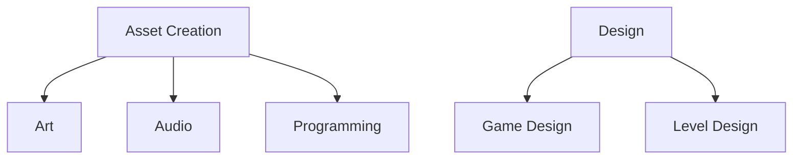
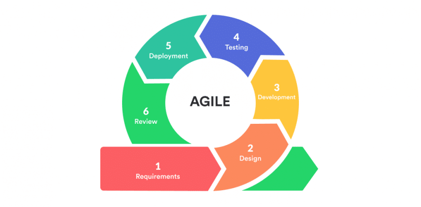
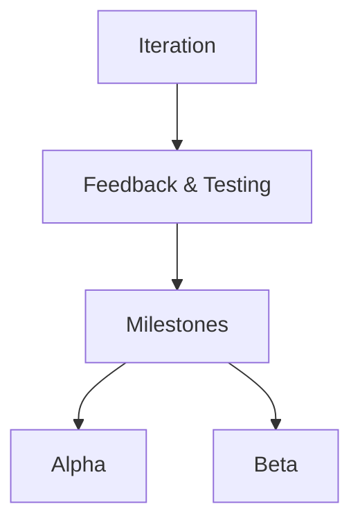

# Game Production Pipeline

In game development, the production pipeline is the process that transforms an initial idea into a fully playable and polished game. It involves several stages, each requiring specific skills and collaboration between different teams. Here's an overview of the key stages of the game production pipeline:

## 1. Concept & Pre-Production

The first stage of the production pipeline is the concept and pre-production phase. This is where the initial idea for the game is developed, and the core mechanics, art style, and story are defined. The team will create concept art, storyboards, and design documents to outline the vision for the game.

- Idea Generation
    1. Brainstorming: The team comes up with ideas for the game. This can involve brainstorming sessions, mood boards, and research into similar games.
    2. Game Design Document: A detailed document outlining the core mechanics, story, characters, and art style of the game. As known as GDD or Whitepaper.

- Prototyping
    1. Playable Prototype: A basic version of the game is created to test the core mechanics and gameplay loop.
    2. Proof of Concept: A small prototype is created to test the core mechanics of the game and see if the idea is feasible.
    3. Vertical Slice: A more advanced prototype that includes a small section of the game to demonstrate the core gameplay loop.

- Pre-Production Planning
    - Art Style & Visual Design: Defining the look and feel of the game, including concept art and mockups.
    - Technical Decisions: Choosing the game engine, tools, and software needed for development (e.g., Unity, Unreal Engine, custom engines).
    - Technical writing: Writing technical documentation, such as coding standards, architecture diagrams, and asset pipelines. Also, the creation of the Technical Design Document (TDD) or Yellowpaper.
    - Team Formation: Identifying and assembling a development team (artists, designers, programmers, sound designers, etc.).

## 2. Production
This phase focuses on building the game. It's where most of the actual game development happens.

1. Asset Creation 
    - Art: Artists create 2D sprites, 3D models, animations, textures, environments, and user interface (UI) elements.
    - Audio: Sound designers create music, sound effects, and voiceovers.
    - Programming: Programmers build the game's code, including game mechanics, AI, physics, and user inputs.
2. Game Design & Level Design
    - Game Design: Designers refine gameplay mechanics, balancing difficulty, and ensuring a smooth player experience.
    - Level Design: Building game levels, worlds, or maps to provide engaging challenges or exploration areas for players.
3. Iteration
    - Feedback & Testing: Internal testing, often called "playtesting," helps identify issues or balance problems. Developers make iterative changes based on this feedback.
4. Milestones
    - Alpha: The game is playable from start to finish, but assets and gameplay may still be incomplete.
    - Beta: The game is feature-complete with all assets, but there may be bugs or areas for optimization.

## 3. Testing & Quality Assurance (QA)
This phase is about polishing and debugging the game to ensure a smooth and bug-free player experience.

1. Bug Fixing
    - QA Testing: Testers play the game in different environments, identify bugs, and report them to the development team.
    - Stress Testing: The game is tested under various conditions, such as handling many players in online modes or testing on different hardware.
2. Optimization
    - Performance Optimization: Developers optimize code, assets, and mechanics to ensure the game runs smoothly across all intended platforms.
    - Polishing: Final tweaks to visuals, sound, and gameplay for a professional finish.

## 4. Launch & Post-production

The game is now released to the public, and the development focus shifts to supporting the game post-launch.

1. Marketing & Distribution
    - Marketing Campaign: Promoting the game through trailers, social media, press releases, and influencer partnerships.
    - Release: The game is distributed through platforms such as Steam, PlayStation Store, Xbox Live, or mobile app stores (App Store, Google Play).
2. Post-Launch Support
    - Patches & Updates: Fixing post-launch bugs and adding new features or improvements based on player feedback.
    - DLC & Expansions: Developers may release downloadable content or expansions to extend the game’s lifespan.
    - Community Engagement: Ongoing interaction with the player base through social media, forums, and events (e.g., tournaments, challenges).